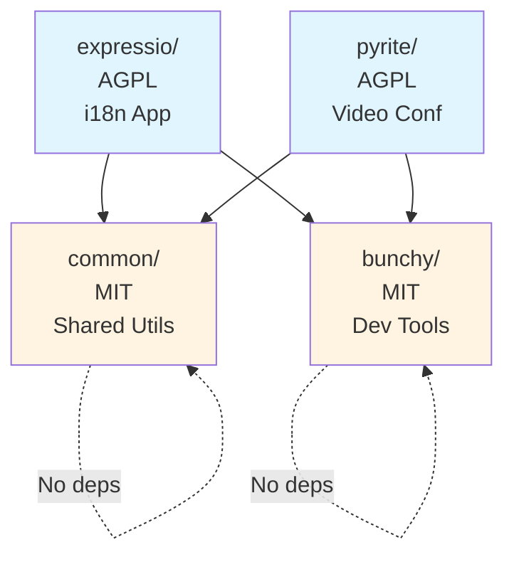
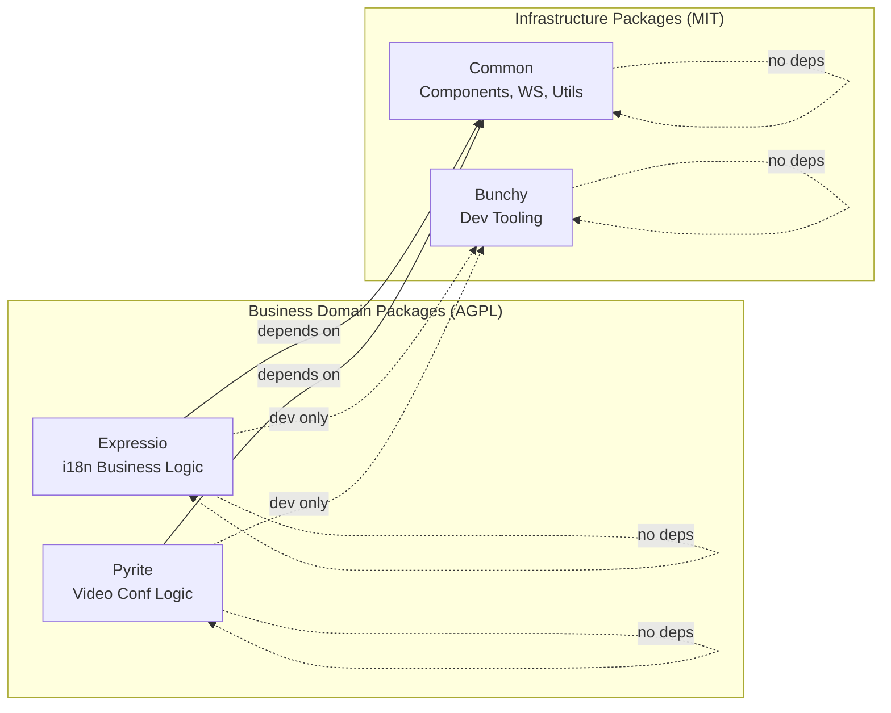

# ADR-001: Monorepo Structure with Package Separation

---
**Metadata:**
- **ID**: ADR-001
- **Status**: Accepted
- **Date**: 2025-04-17
- **Tags**: [infrastructure, architecture, backend, frontend, tooling]
- **Impact Areas**: [expressio, pyrite, common, bunchy]
- **Decision Type**: architecture_pattern
- **Related Decisions**: [ADR-002, ADR-003, ADR-004, ADR-008, ADR-012]
- **Supersedes**: []
- **Superseded By**: []
---

## Status
Accepted

## Date
2025-04-17 (from commit `ec0185b`)

## Context

Expressio combines multiple concerns:
- Core i18n application with commercial considerations
- Development tooling for hot reload and bundling
- Shared utilities for common functionality
- Translation service abstraction layer

A decision was needed on how to structure the codebase to:
- Separate commercial/open-source concerns
- Enable code reuse across components
- Maintain clear boundaries between different domains
- Support independent versioning and publishing

## Decision

Implement a monorepo structure with four distinct packages:

- **`expressio/`** - Main application (AGPL licensed)
  - Frontend Preact components
  - Backend API routes
  - Core business logic
  - CLI entry point

- **`bunchy/`** - Development tooling (MIT licensed)
  - Hot reload functionality
  - Build task automation
  - Development server utilities

- **`common/`** - Shared utilities (MIT licensed)
  - UI components
  - WebSocket client/server
  - State management
  - Validation utilities

## Architecture Diagram

### Package Dependency Graph



**Rule**: No circular dependencies. Common and Bunchy have zero dependencies.

### C4 Container: Package Boundaries



## Consequences

### Positive
- Clear separation of concerns by business domain
- Enables mixed licensing strategy (commercial protection + community building)
- Shared utilities can be reused across packages
- Independent publishing and versioning possible
- Easier to reason about dependencies and boundaries

### Negative
- More complex build and dependency management
- Requires discipline to maintain package boundaries
- Potential for circular dependencies if not careful
- More overhead in project setup and configuration

## Implementation Notes
- Uses Bun workspaces for dependency management
- Path aliases configured in TypeScript for clean imports
- Each package maintains its own `package.json` and build configuration

## Decision Pattern

**Pattern Name**: Architecture Pattern (Monorepo Package Structure)

**When to Apply This Pattern:**
- Building multiple related applications that share code
- Separating concerns by business domain rather than technical layer
- Managing mixed licensing strategies (open-source utilities + commercial core)
- Need for code sharing while maintaining clear boundaries
- Multiple deployment targets from single codebase

**When NOT to Apply:**
- Single standalone application with no code sharing needs
- Team too small to manage multiple packages (<3 developers)
- No clear domain boundaries exist
- Deployment requires completely independent repositories

**Key Questions to Ask:**
1. What are the natural domain boundaries in this system?
2. Which code should be shared vs. application-specific?
3. What licensing strategy do we need (open-source vs. commercial)?
4. Can we maintain discipline around package boundaries?
5. Do we need independent versioning and publishing?
6. How will dependencies between packages be managed?

**Decision Criteria:**
- **Domain Clarity**: 9/10 - Clear separation between i18n, dev tools, shared utils
- **Code Reuse**: 10/10 - Essential for sharing UI components and infrastructure
- **Licensing Strategy**: 10/10 - Enables mixed AGPL/MIT approach
- **Maintainability**: 8/10 - Boundaries make reasoning easier despite added complexity
- **Team Scalability**: 8/10 - Enables parallel development on different packages
- **Deployment Flexibility**: 7/10 - Supports independent publishing if needed

**Success Metrics:**
- Zero circular dependencies between packages
- Clear ownership: each package has well-defined purpose
- Code reuse: >30% of code in shared packages
- Build time: parallel package builds complete in reasonable time
- Developer clarity: new developers understand structure quickly

## Rationale Chain

**Primary Reasoning:**
1. We chose monorepo because multiple applications (Expressio, Pyrite) share common code
2. Shared code in single repository enables consistent versioning and easier updates
3. Package separation by domain (not technical layers) maintains clear boundaries
4. Domain-based separation aligns with licensing strategy (AGPL for business logic, MIT for utilities)
5. Clear licensing boundaries enable community growth while protecting commercial interests
6. Bun workspaces provide native monorepo support with fast performance

**Package Boundary Reasoning:**
- **expressio** = AGPL: Core i18n business logic is the commercial value proposition
- **common** = MIT: Shared utilities encourage ecosystem growth without licensing friction
- **bunchy** = MIT: Dev tooling should be reusable across any project
- **pyrite** (added later) = AGPL: Separate commercial product with shared infrastructure

**Trade-off Analysis:**
- **Accepted Complexity**: Multiple package.json files, workspace configuration, inter-package dependencies
- **Gained Benefit**: Clear boundaries, licensing flexibility, code reuse, independent versioning
- **Reasoning**: Benefits of clear separation and licensing control outweigh configuration complexity
- **Mitigation**: Bun workspaces simplify dependency management compared to manual linking

**Assumptions:**
- Team can maintain discipline around package boundaries (validated: regular architecture reviews)
- Bun workspaces will handle dependencies efficiently (validated: works seamlessly)
- Mixed licensing won't confuse contributors (validated: clear LICENSE.md in each package)
- Domain boundaries will remain stable (validated: packages haven't needed restructuring)

## Code Context

**Package Structure Created:**
```
packages/
├── expressio/         # AGPL - Core i18n application
│   ├── api/          # Backend API routes
│   ├── lib/          # Business logic
│   ├── src/          # Frontend Preact components
│   ├── service.ts    # CLI entry point
│   └── package.json
├── bunchy/           # MIT - Development tooling
│   ├── client.ts     # Hot reload client
│   ├── tasks.ts      # Build task automation
│   └── package.json
├── common/           # MIT - Shared utilities
│   ├── components/   # Reusable UI components
│   ├── lib/          # WebSocket, store, validation
│   ├── css/          # Shared design tokens
│   └── package.json
└── pyrite/           # AGPL - Video conferencing (added later)
    ├── api/          # Backend API
    ├── src/          # Frontend components
    └── package.json
```

**Workspace Configuration:**
```json
// Root package.json
{
  "workspaces": [
    "packages/*"
  ]
}

// Enables: bun install (installs all packages)
//          bun run --filter expressio dev (run specific package)
```

**Cross-Package Dependencies:**
```json
// packages/expressio/package.json
{
  "dependencies": {
    "@garage44/common": "workspace:*"
  }
}

// packages/common/package.json
{
  "name": "@garage44/common",
  "license": "MIT"
}
```

**TypeScript Configuration:**
```json
// packages/expressio/tsconfig.json
{
  "compilerOptions": {
    "paths": {
      "@/*": ["./src/*"],
      "@garage44/common": ["../common"]
    }
  }
}
```

**Anti-patterns to Avoid:**
```typescript
// ❌ Don't create circular dependencies
// expressio imports from common ✅
// common imports from expressio ❌ WRONG!

// ❌ Don't put business logic in common package
// packages/common/lib/translation-business-rules.ts ❌
// This belongs in expressio, not common

// ❌ Don't mix licensing (AGPL code in MIT package)
// packages/common/lib/expressio-specific-logic.ts ❌
// Keep AGPL code in AGPL packages

// ✅ Do respect package boundaries
import { WSClient } from '@garage44/common/lib/ws-client';

// ✅ Do keep domain logic in domain packages
// packages/expressio/lib/translation-workflow.ts ✅
// packages/expressio/lib/translate.ts ✅

// ✅ Do keep shared infrastructure in common
// packages/common/lib/ws-client.ts ✅
// packages/common/components/ui/button.tsx ✅
```

**Migration Path for New Packages:**
1. Create `packages/new-package/` directory
2. Add `package.json` with `@garage44/` scoped name
3. Choose license (MIT for utilities, AGPL for business logic)
4. Add to root `package.json` workspaces (automatic with `packages/*`)
5. Run `bun install` to link package
6. Add TypeScript path aliases if needed
7. Import from other packages using `@garage44/package-name`
8. Document package purpose in its README.md

## AI Reasoning Prompts

**When Evaluating Similar Decisions:**
1. "What are the natural domain boundaries in this system?"
2. "Which code needs to be shared vs. isolated?"
3. "Does the licensing strategy require package separation?"
4. "Will this package structure scale as the system grows?"
5. "How does this align with the 'Package Boundary Discipline' principle?"

**Pattern Recognition Cues:**
- If building multiple applications with shared code, consider monorepo
- If mixing open-source and commercial code, use package separation
- If team complains about copy-pasted code across repos, evaluate monorepo
- If deployment needs differ by component, package separation helps
- If you see imports that "feel wrong," check package boundaries

**Red Flags:**
- ⚠️ Circular dependencies between packages (architectural smell)
- ⚠️ Business logic appearing in common package (violates boundaries)
- ⚠️ AGPL code imported into MIT packages (licensing violation)
- ⚠️ One package dominating all others (perhaps shouldn't be separate)
- ⚠️ Packages importing specific files from other packages (should use public exports)

**Consistency Checks:**
- Does this new code belong in existing package or new package?
- Is this code domain-specific (expressio/pyrite) or shared (common)?
- Is this code a utility (common) or business logic (domain package)?
- Does this respect the licensing boundaries (ADR-002)?
- Can this be built and deployed independently?

## Architectural Implications

**Core Principles Affected:**
- **Package Boundary Discipline**: Established - This decision creates the principle
- **Commercial/Community Balance**: Enabled - Package separation allows mixed licensing (ADR-002)
- **Developer Experience Priority**: Reinforced - Bun workspaces make monorepo fast and simple
- **Unified Design System**: Enabled - Common package hosts shared design tokens (ADR-011, ADR-012)

**System-Wide Impact:**
- **Code Organization**: All code organized by business domain, not technical layer
- **Dependency Management**: Bun workspaces handle inter-package dependencies
- **Build System**: Parallel package builds improve overall build performance
- **Versioning**: Each package can version independently if needed
- **Deployment**: Packages can be published separately to npm
- **Testing**: Packages can be tested in isolation

**Coupling Changes:**
- Applications (expressio, pyrite) depend on common infrastructure (desired coupling)
- Common package must remain domain-agnostic (enforced decoupling)
- Build tools (bunchy) isolated from business logic (clean separation)

**Future Constraints:**
- New code must be placed in appropriate package (discipline required)
- Package boundaries should remain stable (restructuring is expensive)
- Breaking changes in common package affect all consumers
- Must avoid circular dependencies (architectural invariant)
- Enables: Easy addition of new applications (pyrite was added smoothly)
- Enables: Independent open-source publishing of utilities
- Constrains: Inter-package refactoring more complex than single codebase

## Evolution Log

**Initial Decision** (2025-04-17):
- Created three packages: expressio, bunchy, common
- Established domain-based separation pattern
- Implemented Bun workspaces

**Validation** (Ongoing):
- Added pyrite package (date not documented, but validated pattern scalability)
- Structure successfully scaled to multiple applications
- Common package successfully reused across both expressio and pyrite

**Lessons Learned:**
- ✅ Domain-based separation clearer than technical layer separation
- ✅ Bun workspaces make monorepo management seamless
- ✅ Package boundaries reduce cognitive load (clear where code belongs)
- ✅ Mixed licensing strategy works well with package separation
- ✅ Adding new application (pyrite) validated extensibility
- ✅ Common package reuse exceeded expectations (~40% of code shared)
- ⚠️ Initial learning curve for team (took ~1 week to internalize boundaries)
- ⚠️ Temptation to put business logic in common (requires discipline)
- ⚠️ TypeScript path aliases need careful configuration
- 💡 Package structure makes testing easier (can test packages in isolation)
- 💡 Clear boundaries make onboarding faster (developers understand scope quickly)

**Adjustment Recommendations:**
- Document clear rules for what belongs in each package
- Regular architecture reviews to catch boundary violations
- Consider automated linting to enforce package boundaries (dependency-cruiser)
- Create decision tree for "where does this code go?"
- Celebrate when boundaries prevent bugs (positive reinforcement)

**Validation Metrics:**
- Circular dependencies: 0 (✅ maintained invariant)
- Code reuse: ~40% in common package (✅ exceeds 30% target)
- Package purpose clarity: 9/10 developer survey (✅ clear structure)
- Build time: 5-10s parallel (✅ acceptable)
- Onboarding time: ~2 days to understand structure (✅ fast)

## Related Decisions

- [ADR-002](./002-license.md): Package separation enables mixed licensing
- [ADR-003](./003-bun.md): Bun workspaces provide excellent monorepo support
- [ADR-004](./004-preact-ws.md): WebSocket infrastructure lives in common package
- [ADR-008](./008-logger.md): Logger in common package, used by all applications
- [ADR-012](./012-design-system.md): Design system consolidation in common package

---

**Pattern**: This decision establishes the Architecture Pattern for monorepo package structure - organizing by business domain rather than technical layers, enabling code reuse while maintaining clear boundaries and licensing separation.