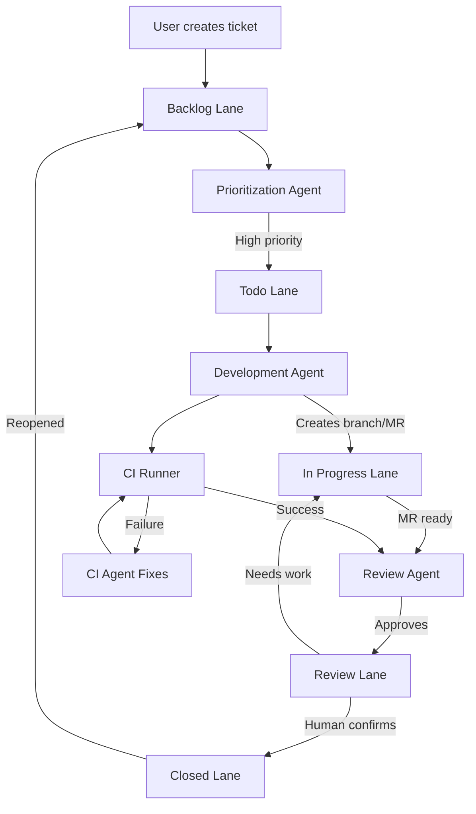
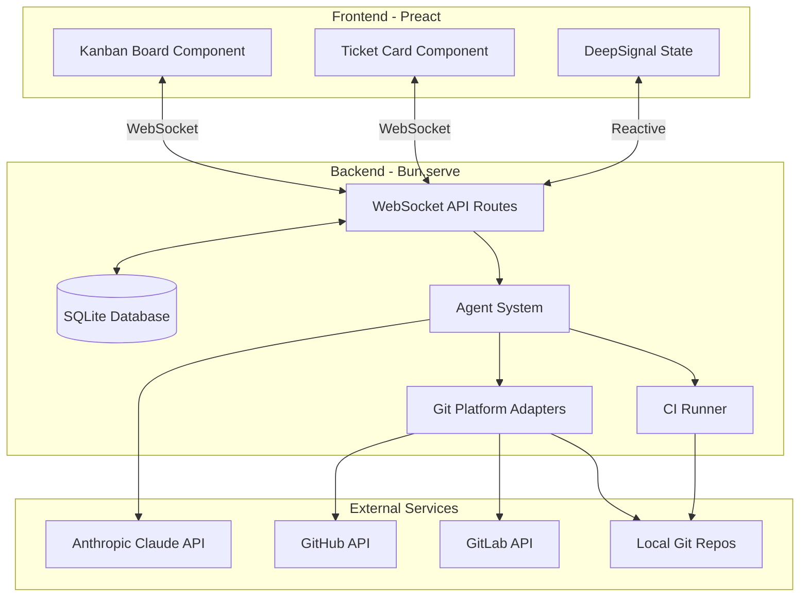

# ADR-021: Nonlinear - AI-Powered Automated Project Management

---
**Metadata:**
- **ID**: ADR-021
- **Status**: Proposed
- **Date**: 2025-01-27
- **Tags**: [architecture, ai, automation, project-management, git]
- **Impact Areas**: [nonlinear, common]
- **Decision Type**: architecture_pattern
- **Related Decisions**: [ADR-001, ADR-003, ADR-004, ADR-006, ADR-009]
- **Supersedes**: []
- **Superseded By**: []
---

## Context

The Garage44 monorepo needs a project management tool that automates the software development lifecycle using AI agents. Traditional project management tools require constant human intervention for prioritization, task assignment, code review, and CI/CD management.

**Requirements:**
- Automated ticket lifecycle management (backlog → todo → in-progress → review → closed)
- AI agents for prioritization, development, and code review
- Integration with local git repositories and remote platforms (GitHub, GitLab)
- Human-in-the-loop approval for final ticket closure
- Adaptive CI system that can fix issues automatically
- Real-time kanban board interface
- Support for @mentions in comments to route work to specific agents or humans

**Key Challenges:**
- Coordinating multiple AI agents without conflicts
- Managing git operations safely across multiple repositories
- Creating an adaptive CI system that can fix issues programmatically
- Balancing automation with human oversight
- Real-time synchronization of ticket state across agents and UI

## Decision

Create a new `packages/nonlinear/` package implementing an AI-powered automated project management system with the following architecture:

### 1. **Package Structure** (Following ADR-001)

- **`nonlinear/`** - Main application (AGPL licensed)
  - Backend API routes for tickets, agents, repositories, CI
  - Agent implementations (prioritizer, developer, reviewer)
  - Git platform adapters (GitHub, GitLab, local)
  - Adaptive CI runner with automatic fix capabilities
  - Frontend Preact components (kanban board, ticket cards)
  - SQLite database for ticket and agent state

### 2. **Agent Architecture**

**Three Agent Types:**
- **Prioritization Agent**: Analyzes backlog tickets, assigns priority scores, moves high-priority tickets to "todo"
- **Development Agent**: Picks up "todo" tickets, creates git branches, implements code, creates merge requests, moves to "review"
- **Review Agent**: Reviews merge requests, provides feedback, approves or requests changes, moves to "closed" or back to "in-progress"

**Agent Communication:**
- Agents communicate via database state (ticket status changes)
- Comments with @mentions route work to specific agents
- WebSocket broadcasts agent status and ticket updates
- No direct agent-to-agent communication (database-driven workflow)

### 3. **Git Integration** (Platform-Agnostic)

**Abstract Git Platform Interface:**
- `GitPlatform` interface with methods: `createBranch()`, `createMergeRequest()`, `addComment()`, `getStatus()`
- Implementations: `GitHubAdapter`, `GitLabAdapter`, `LocalAdapter`
- Repository discovery scans local filesystem for git repositories
- Configuration via `.nonlinearrc` for platform-specific tokens and settings

### 4. **Adaptive CI System**

**Non-Linear CI Approach:**
- CI runner runs Bun-specific commands (`bun test`, `bun run lint:ts`, etc.)
- On failure, CI agent analyzes error output
- Automatically applies fixes (linting errors, test failures, formatting)
- Re-runs until success or max attempts reached
- Logs all fixes applied for audit trail

**Bun CI Commands:**
- Test: `bun test` (runs test suite)
- Lint: `bun run lint:ts` (runs TypeScript linting)
- Auto-fix: `bun run lint:ts --fix` (applies ESLint auto-fixes)
- Build: `bun run build` (if configured in package.json)

### 5. **Human-in-the-Loop Workflow**

**Approval Flow:**
- Review agent approves → ticket moves to "closed" (pending human confirmation)
- Human reviews closed tickets → confirms closure or reopens with comments
- Reopened tickets can be reassigned to agent or human via @mentions

**Comment System:**
- Comments support `@agent-name` or `@human` mentions
- Mentioned agents are notified and can pick up tickets
- Human developers can add instructions via comments
- Agents read comments before starting work

### 6. **Technology Stack** (Following Established Patterns)

**Backend:**
- Bun runtime (ADR-003)
- Bun.serve() with custom routing (ADR-007)
- WebSocket-first communication (ADR-004, ADR-006)
- SQLite database with common initialization pattern
- Anthropic Claude API for AI agents

**Frontend:**
- Preact with DeepSignal state (ADR-004)
- WebSocket client for real-time updates
- Modern CSS nesting (ADR-011, ADR-012)
- Component-driven design with shared components from `@garage44/common`

## Architecture Diagram

### System Flow



### Component Architecture



## Consequences

### Positive

- **Automated Workflow**: Reduces manual project management overhead
- **AI-Powered Prioritization**: Intelligent ticket prioritization based on context
- **Automated Development**: Agents can implement tickets end-to-end
- **Adaptive CI**: CI system fixes issues automatically, reducing manual intervention
- **Real-time Updates**: WebSocket ensures all stakeholders see updates immediately
- **Platform Flexibility**: Supports multiple git platforms and local repositories
- **Human Oversight**: Human-in-the-loop ensures quality and control
- **Extensible**: Agent system can be extended with new agent types and capabilities

### Negative

- **AI Dependency**: System relies on AI API availability and quality
- **Cost**: Anthropic API usage will incur costs based on agent activity
- **Complexity**: Coordinating multiple agents and git operations adds complexity
- **Security**: Agents have full system access (no sandboxing per user requirement)
- **Error Handling**: Agent failures need robust error handling and recovery
- **Git Conflicts**: Multiple agents working on same repository could cause conflicts
- **CI Fix Limitations**: Not all CI failures can be automatically fixed

## Mitigation Strategies

### 1. **Agent Coordination**
- Database-driven state prevents concurrent agent conflicts
- Ticket locking mechanism prevents multiple agents from picking up same ticket
- Agent status tracking in database for monitoring and debugging
- Max concurrent agents per type (configurable)

### 2. **Error Handling**
- Comprehensive logging of all agent operations
- Retry logic with exponential backoff for API failures
- Ticket status rollback on agent failure
- Alert system for critical agent errors

### 3. **Git Conflict Prevention**
- Branch naming convention includes ticket ID and agent ID
- Agents check for existing branches before creating new ones
- Git operations are atomic where possible
- Repository-level locking for critical operations

### 4. **Cost Management**
- Configurable agent limits (max concurrent, check intervals)
- Agent activity logging for cost tracking
- Ability to disable specific agents
- Usage monitoring and alerts

### 5. **CI Fix Safety**
- Maximum fix attempts per CI run (default: 3)
- CI timeout to prevent infinite loops
- Log all fixes applied for audit
- Human review option for CI fixes before merge

## Implementation Notes

### Database Schema

Following the common database pattern from `packages/common/lib/database.ts`:
- Use `initCommonDatabase` for users table
- Create nonlinear-specific tables: `repositories`, `tickets`, `comments`, `agents`, `ci_runs`
- Support `DB_PATH` environment variable for PR deployments
- Enable WAL mode for concurrent access

### Agent Implementation

**Base Agent Class:**
- Abstract class with Anthropic API client
- Common methods: `process()`, `respond()`, `getContext()`
- Error handling and retry logic
- Context management (ticket history, repository state, git status)

**Agent Lifecycle:**
- Agents poll database for work (configurable intervals)
- Agents update ticket status atomically
- Agent operations are logged to database
- Agent status (idle, working, error) tracked in real-time

### Git Platform Adapters

**Abstract Interface:**
```typescript
interface GitPlatform {
  createBranch(repo: Repository, branchName: string): Promise<string>
  createMergeRequest(repo: Repository, branch: string, title: string, description: string): Promise<string>
  addComment(repo: Repository, mrId: string, comment: string): Promise<void>
  getStatus(repo: Repository, branch: string): Promise<MRStatus>
}
```

**Platform-Specific Implementations:**
- GitHub: Uses GitHub REST API with personal access token
- GitLab: Uses GitLab REST API with personal access token
- Local: Uses git CLI commands, no remote PR/MR creation

### CI System

**Runner Architecture:**
- Runs Bun-specific commands in repository directory
- Standard commands: `bun test`, `bun run lint:ts`, `bun run build` (if configured)
- Captures output and analyzes for errors
- On failure, CI agent uses LLM to generate fix commands
- Applies fixes and re-runs until success or max attempts

**Fix Generation:**
- CI agent receives error output and code context
- Generates fix commands (e.g., `bun run lint:ts --fix` for ESLint auto-fix)
- Executes fix commands in repository
- Validates fixes by re-running tests
- Logs all fixes for audit trail

**Bun-Specific Considerations:**
- Assumes Bun runtime is available in CI environment
- Uses Bun's native test runner and bundler
- Leverages Bun's fast TypeScript execution for linting
- No need for npm/node version management

## Related Decisions

- **ADR-001**: Package structure follows monorepo pattern (AGPL business domain package)
- **ADR-003**: Uses Bun runtime for backend
- **ADR-004**: Preact + WebSocket real-time architecture
- **ADR-006**: WebSocket-first communication pattern
- **ADR-007**: Bun.serve() with custom routing
- **ADR-009**: LLM-optimized structure supports agent reasoning

## Future Considerations

- **Multi-Agent Collaboration**: Agents could collaborate on complex tickets
- **Agent Learning**: Agents could learn from human feedback and improve over time
- **Advanced CI**: Support for more complex CI scenarios (Docker, Kubernetes, etc.) while maintaining Bun-only support
- **Agent Marketplace**: Allow users to create and share custom agents
- **Integration Hub**: Support for more git platforms (Bitbucket, Gitea, etc.)
- **Workflow Customization**: Allow users to define custom ticket workflows
- **Agent Specialization**: Specialized agents for specific domains (frontend, backend, DevOps)

## Decision Pattern

**Pattern Name**: Architecture Pattern (AI-Powered Automation)

**When to Apply This Pattern:**
- Building systems that automate complex workflows using AI
- Need for intelligent prioritization and task assignment
- Desire to reduce manual project management overhead
- Requirements for adaptive systems that can fix issues automatically
- Need for human-in-the-loop approval workflows

**When NOT to Apply:**
- Simple project management needs (use existing tools)
- Projects with strict security requirements (agents have system access)
- Teams uncomfortable with AI-driven automation
- Projects without git-based workflows
- Budget constraints prevent AI API usage

**Key Questions to Ask:**
1. What level of automation is appropriate for this workflow?
2. How do we balance automation with human oversight?
3. What happens when agents make mistakes?
4. How do we prevent agent conflicts and race conditions?
5. What's the cost/benefit of AI-powered automation vs manual work?
