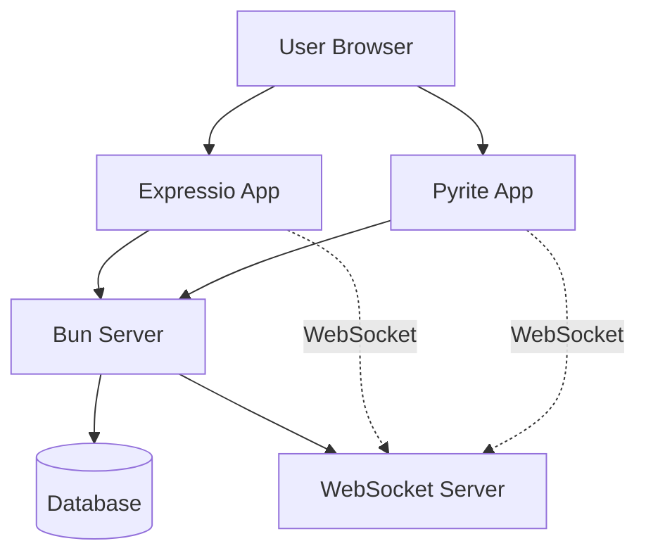
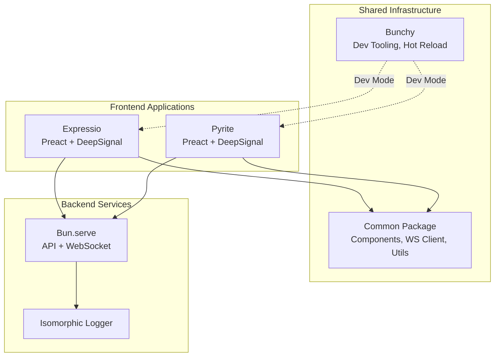
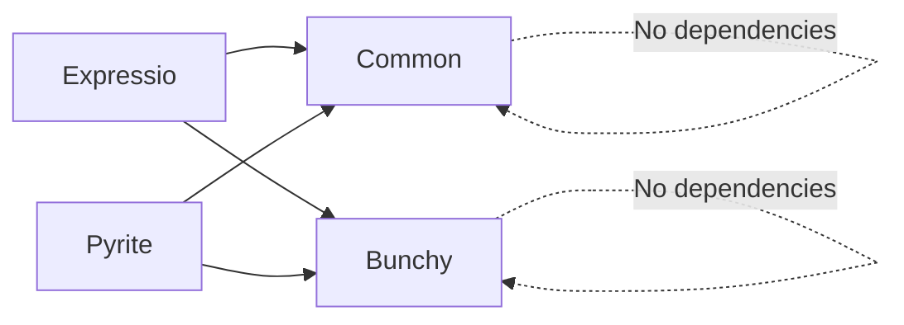
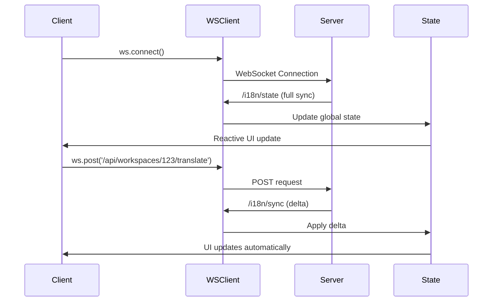

# Garage44 Architecture Reference

**Purpose**: Current architectural state optimized for LLM consumption. Git history provides change tracking.

## System Overview

**Monorepo Structure**: Domain-separated packages (ADR-001)
- `expressio/` - i18n application (AGPL)
- `pyrite/` - Video conferencing (AGPL)
- `common/` - Shared utilities (MIT)
- `bunchy/` - Dev tooling (MIT)

**Runtime**: Bun (ADR-003)
- ES2023, ES modules (`type: "module"`)
- Native TypeScript execution
- Built-in bundler

**Frontend**: Preact + WebSocket (ADR-004)
- State: DeepSignal (not useState)
- NOT Express.js
- WebSocket server in common package
- Isomorphic logger (ADR-008)

## Core Principles

1. **Real-time First**: WebSocket default for user-facing features (ADR-004, ADR-006)
2. **Package Boundary Discipline**: Domain separation, not technical layers (ADR-001)
3. **Developer Experience Priority**: Fast iteration, modern tooling (ADR-003, ADR-010)
4. **Commercial/Community Balance**: AGPL core, MIT utilities (ADR-002)
5. **LLM-Optimized Documentation**: Structured for AI consumption (ADR-009)
6. **Unified Design System**: Shared tokens via `@garage44/common/css/theme.css` (ADR-011, ADR-012)

## Technology Stack

| Layer | Technology | ADR | Rationale |
|-------|-----------|-----|-----------|
| Runtime | Bun | ADR-003 | Fast startup, native TS, built-in bundler |
| Frontend Framework | Preact | ADR-004 | 3KB vs 45KB React, compatible API |
| State Management | DeepSignal | ADR-004 | Proxy-based reactivity, no boilerplate |
| Communication | WebSocket | ADR-004, ADR-006 | Real-time bidirectional updates |
| Server | Bun.serve() | ADR-007 | Native Bun server, not Express |
| CSS | Native CSS + OKLCH | ADR-011 | Modern nesting, perceptual uniformity |
| Linting | OxLint | ADR-010 | Rust-based, 10x faster than ESLint |
| i18n | Type-safe object refs | ADR-019 | `$t(i18n.path.to.tag)` not strings |

## Architecture Diagrams

### C4 Level 1: System Context



### C4 Level 2: Container Diagram



### Package Dependencies



**Rule**: No circular dependencies. Common and Bunchy have no dependencies.

## Communication Patterns

### WebSocket Architecture



**Pattern**: WebSocket-first for real-time features, REST fallback for one-time operations.

## Package Boundaries

### Expressio Package
- **Purpose**: i18n translation management
- **License**: AGPL
- **Dependencies**: `@garage44/common`
- **Exports**: API routes, business logic, Preact components
- **Boundary Rule**: No business logic in common package

### Pyrite Package
- **Purpose**: Video conferencing
- **License**: AGPL
- **Dependencies**: `@garage44/common`
- **Exports**: API routes, business logic, Preact components
- **Boundary Rule**: No business logic in common package

### Common Package
- **Purpose**: Shared utilities, components, infrastructure
- **License**: MIT
- **Dependencies**: None (pure utilities)
- **Exports**: UI components, WebSocket client/server, logger, validation, design tokens
- **Boundary Rule**: Domain-agnostic only, no business logic

### Bunchy Package
- **Purpose**: Development tooling
- **License**: MIT
- **Dependencies**: None
- **Exports**: Hot reload client, build tasks
- **Boundary Rule**: Dev-time only, not runtime dependency

## Design System

### Token Hierarchy

```
@garage44/common/css/theme.css (single import)
├── Spacing: --spacer-1 through --spacer-4
├── Typography: --font-size-base, --font-size-lg, --font-size-xl
├── Colors: OKLCH scales (--info-0 through --info-9)
└── Semantic: --success, --error, --warning, --bg-primary, --text-primary
```

**Usage Pattern**:
```css
/* Project CSS */
@import "../../../common/css/theme.css";  /* Single import */
@import "./_variables.css";                /* Project overrides */
```

**Rule**: Use design tokens, not hardcoded values. OKLCH for color scales.

## State Management

### DeepSignal Pattern

```typescript
// ✅ State defined OUTSIDE component (critical for stability)
const state = deepSignal({
  username: '',
  password: '',
  workspace_id: null
})

// ✅ Component uses stable state reference
const LoginForm = () => {
  return (
    <FieldText model={state.$username} />  // Signal passed directly
    <FieldSelect model={state.$workspace_id} />
  )
}

// ❌ DON'T define state inside component (causes infinite re-renders)
const BadComponent = () => {
  const state = deepSignal({count: 0})  // Wrong!
  return <div>{state.count}</div>
}
```

**Rule**: Define DeepSignal state outside components. Pass signals (`state.$field`) to Field components.

## Anti-Patterns

### ❌ Technology Anti-Patterns
- Express.js (use Bun.serve per ADR-007)
- ESLint (use OxLint per ADR-010)
- SCSS (use native CSS per ADR-011)
- React useState (use DeepSignal per ADR-004)
- REST for real-time features (use WebSocket per ADR-004)

### ❌ Architecture Anti-Patterns
- Business logic in common package (violates ADR-001)
- Circular package dependencies (violates ADR-001)
- Inline styles (use CSS classes per ADR-011)
- Magic strings for i18n (use object refs per ADR-019)

### ❌ Pattern Anti-Patterns
- Defining DeepSignal inside components
- Importing individual CSS files instead of theme.css
- Using $s.workspace.i18n instead of app-level i18n export
- Polling REST endpoints instead of WebSocket subscriptions

## Decision Quick Reference

| Decision Area | Current Approach | ADR | Key Constraint |
|---------------|------------------|-----|----------------|
| Monorepo Structure | Domain-separated packages | ADR-001 | No circular deps |
| Runtime | Bun | ADR-003 | ES2023, ES modules |
| Frontend | Preact + DeepSignal | ADR-004 | WebSocket-first |
| Server | Bun.serve() | ADR-007 | NOT Express |
| CSS | Native CSS + OKLCH | ADR-011 | Single theme.css import |
| Linting | OxLint | ADR-010 | NOT ESLint |
| i18n | Type-safe object refs | ADR-019 | `$t(i18n.path)` not strings |
| Logger | Isomorphic | ADR-008 | Browser + Node compatible |

## Related ADRs

- **ADR-001**: Monorepo structure and package boundaries
- **ADR-003**: Bun runtime adoption
- **ADR-004**: Preact + WebSocket architecture
- **ADR-006**: REST to WebSocket migration
- **ADR-007**: Bun.serve() migration
- **ADR-008**: Isomorphic logger
- **ADR-010**: OxLint adoption
- **ADR-011**: Modern CSS migration
- **ADR-012**: Design system consolidation
- **ADR-019**: Type-safe i18n system
