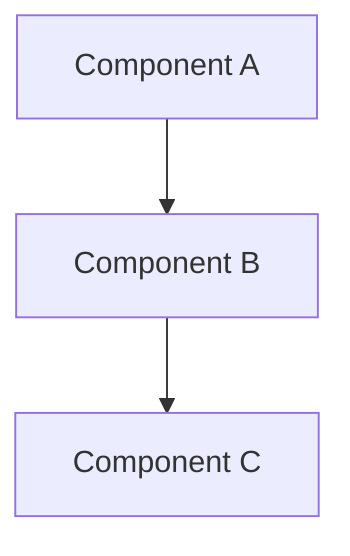

# ADR-XXX: [Title]

---
**Metadata:**
- **ID**: ADR-XXX
- **Status**: Accepted | Proposed | Deprecated
- **Date**: YYYY-MM-DD
- **Tags**: [tag1, tag2]
- **Impact Areas**: [package1, package2]
- **Decision Type**: technology_choice | architecture_pattern | tool_adoption | process_change
- **Related**: [ADR-YYY, ADR-ZZZ]
- **Supersedes**: [ADR-XXX] | []
- **Superseded By**: [] | [ADR-XXX]
---

## Decision

[One-sentence decision statement]

**Approach**: [Specific technology/pattern/method chosen]

**Key Constraints**: [Must-have requirements]

## Context

**Problem**: [What problem this solves]

**Requirements**:
- [Requirement 1]
- [Requirement 2]

**Current State**: [Baseline situation]

## Rationale

**Primary Reasoning**:
1. [Reason 1 → enables → benefit]
2. [Reason 2 → addresses → requirement]

**Alternatives Considered**:

| Alternative | Pros | Cons | Rejected Because |
|------------|------|------|------------------|
| Alt 1 | [Benefit] | [Drawback] | [Specific reason] |
| Alt 2 | [Benefit] | [Drawback] | [Specific reason] |

**Trade-offs**:
- Accepted: [Constraint] → Gained: [Benefit]
- Mitigation: [How constraint is handled]

## Implementation

**Files Created**:
- `path/to/file.ts` - [Purpose]

**Files Modified**:
- `path/to/file.ts` - [Change made]

**Pattern**:
```typescript
// ✅ Correct implementation
import { X } from '@garage44/common'

export const Example = () => {
  // Implementation
}
```

**Anti-patterns**:
```typescript
// ❌ Don't do this: [Why it's wrong]
// ✅ Do this instead: [Correct approach]
```

## Consequences

**Positive**:
- [Benefit 1]: [Quantified impact if available]
- [Benefit 2]: [Specific improvement]

**Negative**:
- [Constraint 1]: [Mitigation strategy]
- [Risk 1]: [Monitoring approach]

## Architecture Impact

**Principles Affected**:
- [Principle]: [Reinforced/Modified] - [How]

**System-Wide Changes**:
- **Packages**: [Impact on package boundaries]
- **Communication**: [Changes to data flow]
- **Dependencies**: [New/removed dependencies]

**Future Constraints**:
- [Constraint 1]: [What this enables/prevents]
- [Constraint 2]: [Long-term implication]

## Decision Pattern

**When to Apply**:
- [Condition 1]
- [Condition 2]

**When NOT to Apply**:
- [Anti-condition 1]
- [Anti-condition 2]

**Criteria** (weighted):
- [Criterion 1]: X/10
- [Criterion 2]: Y/10

**Success Metrics**:
- [Metric]: [Target value]

## AI Prompts

**When Evaluating Similar Decisions**:
1. "[Question about alignment]"
2. "[Question about trade-offs]"

**Pattern Recognition**:
- If [situation], consider this pattern
- If [requirement], review this ADR

**Red Flags**:
- ⚠️ [Warning sign]: [What it indicates]

**Consistency Checks**:
- Aligns with ADR-XXX: [How]
- Contradicts ADR-YYY: [If so, why]

## Diagrams

[Include C4 or Mermaid diagrams where appropriate]



## Related

- [ADR-XXX](./xxx-title.md): [Relationship]
- [ADR-YYY](./yyy-title.md): [Relationship]
